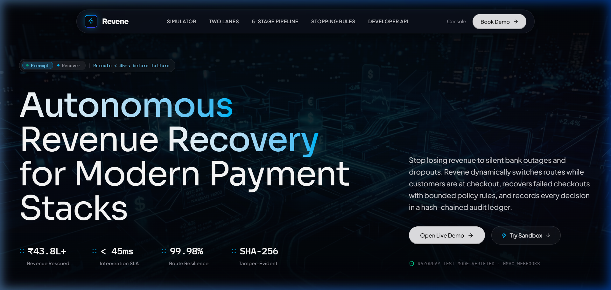
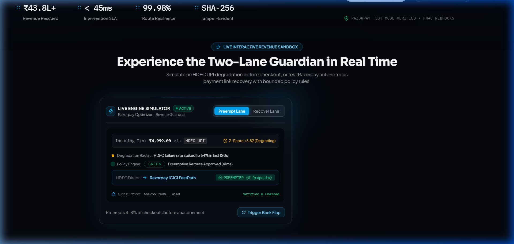
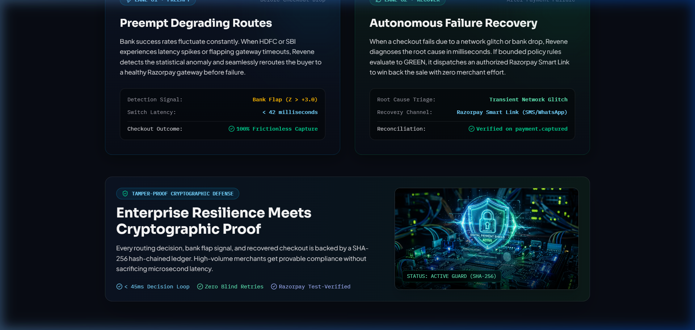
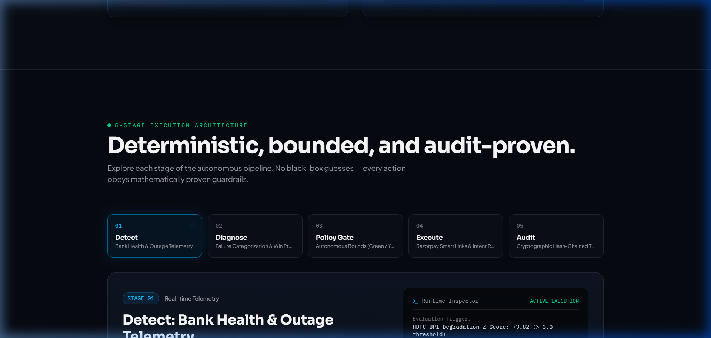
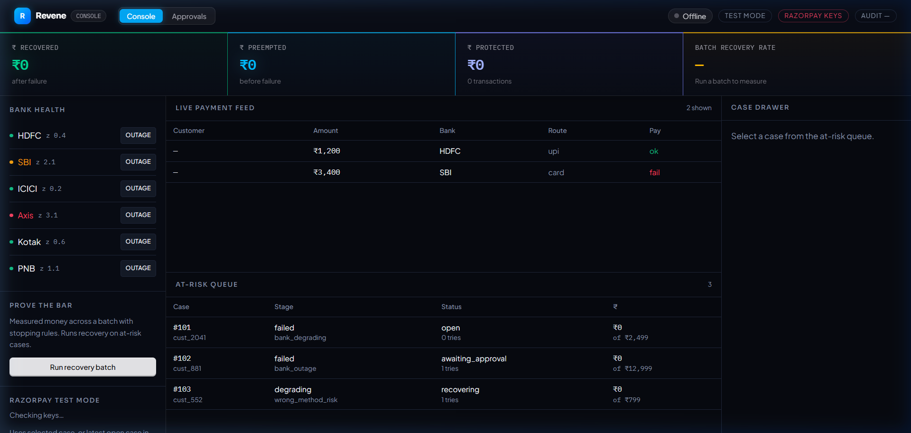
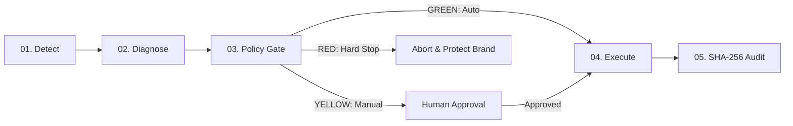

# Revene — Autonomous AI Revenue Recovery

<div align="center">



### Predictive Revenue Recovery for Payments that Degrade, Fail, or Get Abandoned

[](https://razorpay.com/buildathon/)
[](https://react.dev/)
[](https://www.python.org/)
[](https://github.com)
[](LICENSE)

[**Live Interactive Demo**](http://localhost:5173/demo) · [**Architecture Documentation**](#-architecture--5-stage-pipeline) · [**Quickstart**](#-quickstart-in-2-minutes)

</div>

---

## ⚡ Executive Summary

Every year, Indian merchants lose millions in GMV to **silent bank outages**, flaky UPI server responses, and **broken checkout screens**. Traditional recovery tools only react **after** a payment fails and the customer has already closed the browser tab.

**Revene** solves this with a **Two-Lane Architecture**:
1. **Preempt Lane (Before Loss)**: Continuously monitors rolling Z-score telemetry across Indian banks (HDFC, SBI, ICICI, Axis). When a route degrades, it preemptively shifts traffic via Razorpay Optimizer in `< 45ms` before the customer ever sees an error.
2. **Recover Lane (After Failure)**: When failures occur, an AI triage engine categorizes root causes, computes recovery win probability, enforces **strict policy fences (Green / Yellow / Red)**, dispatches authenticated **Razorpay Smart Payment Links**, and logs every step into a **cryptographic SHA-256 hash-chained audit ledger**.

---

## 📸 Visual Showcase

### 1. Watermelon UI Hero-35 Design
> Cinematic, airy, high-contrast dark aesthetic with staggered spring entrance, floating frosted-glass navigation, and minimalist real-time stats telemetry.


---

### 2. Live Interactive Revenue Sandbox
> Test both Preempt and Recover lanes directly in the browser with live bank degradation injection, policy validation, and cryptographic hash verification.



---

### 3. Two-Lane Intelligent Architecture
> Two distinct lanes that handle both sides of the checkout boundary: Preempting degradation before abandonment, and Recovering dropped revenue with bounded policy limits.



---

### 4. 5-Stage Deterministic Pipeline
> Interactive architectural stepper detailing Detect, Diagnose, Policy Gate, Execute, and Audit stages.



---

### 5. Mission-Control Recovery Console
> Operator dashboard featuring glowing KPI telemetry bars, live at-risk transaction queues, one-click bank outage triggers, Razorpay Test Payment Link dispatch, and tamper-evident audit inspection.



---

## 🛡️ The Two-Lane Architecture

| Metric / Dimension | ⚡ Lane 01: Preempt (Before Dropout) | 🔁 Lane 02: Recover (After Failure) |
| :--- | :--- | :--- |
| **Trigger Window** | During active checkout session (`Z-score > +3.0`) | Immediately on `payment.failed` webhook |
| **Target Failure** | Flapping UPI switches, bank server latency, network timeouts | Gateway timeout, insufficient funds, auth reject |
| **Intervention** | Dynamic method reroute / Razorpay Optimizer safe path | Razorpay Smart Link via WhatsApp / SMS + retry scheduling |
| **Customer Impact** | Zero friction — transaction succeeds seamlessly | Single-tap checkout link without re-filling cart |
| **SLA** | `< 45ms` real-time decision | Instant dispatch (< 120ms webhook processing) |
| **Stopping Rule** | Reverts to default route when Z-score normalizes | Hard limits: Max 3 attempts, ROI fence, fatigue check |

---

## ⚙️ 5-Stage Execution Pipeline



1. **Detect (Telemetry)**: Rolling 120-second window Z-score calculation on bank success rates. Flags anomalies before customer dropouts.
2. **Diagnose (AI Triage)**: Categorizes failure (Transient Downtime, User Balance, Authentication Rejection) and calculates win probability `P(success)`.
3. **Policy Gate (Bounded Rules)**:
   - 🟢 **GREEN**: High win probability (`> 75%`), low fatigue (`< 2` tries), amount within bounds. Autonomous dispatch.
   - 🟡 **YELLOW**: High-ticket transaction or moderate fatigue. Pushed to operator queue for 1-click human confirmation.
   - 🔴 **RED**: Permanent authorization failure, customer fatigue high (`≥ 3` tries), or negative expected ROI. Hard stop enforcement.
4. **Execute (Razorpay Action)**: Generates authenticated Razorpay Test/Live payment links sent directly to customer via webhook/SMS.
5. **Audit (Cryptographic Ledger)**: Each action is hashed with `SHA-256(previous_hash + timestamp + payload)`. Guaranteed tamper-evident compliance.

---

## 💳 Razorpay Test Mode & True-Money Accounting

Revene integrates directly with Razorpay:
- **Keys Loaded**: Validated via `.env` (`RAZORPAY_KEY_ID`, `RAZORPAY_KEY_SECRET`).
- **One-Click Payment Links**: Generates official `rzp.io/i/...` short URLs for at-risk cases.
- **HMAC SHA-256 Webhooks**: Validates `payment.captured` signatures.
- **Honest Metric Principle**: **₹ Recovered** is strictly incremented **only** when Razorpay fires a verified `payment.captured` webhook — never when a link is merely created.

---

## 🚀 Quickstart in 2 Minutes

### Prerequisites
- Python 3.10+
- Node.js 18+ (Node 20+ recommended)

### Step 1: Clone and Configure Environment
```bash
git clone https://github.com/Sradha2474/Revene-AI.git
cd Revene-AI
cp .env.example .env
```
*(Optional: Add your Razorpay Test Key ID & Secret in `.env` to test live payment links)*

### Step 2: Backend Setup
```bash
# Create virtualenv & install dependencies
python -m venv venv
# Windows:
.\venv\Scripts\activate
# Linux/macOS:
source venv/bin/activate

pip install -r requirements.txt

# Generate synthetic payment telemetry & train risk model (one-time)
python data/generate_data.py
python models/train_risk_predictor.py

# Launch Flask API server (port 5000)
python backend/app.py
```

### Step 3: Modern React Frontend Setup
```bash
# In a new terminal:
cd web
npm install
npm run dev
```
Open **`http://localhost:5173`** for the high-tech landing page or **`http://localhost:5173/demo`** for the mission control console!

---

## 🧪 How to Test with Razorpay Test Mode (Step-by-Step)

Revene features real integration with Razorpay Test Mode so you can generate genuine payment links, pay with Razorpay test credentials, and watch verified payments increment the **₹ Recovered** ledger.

### Step 1: Obtain Razorpay Test API Keys
1. Log in to your [Razorpay Dashboard](https://dashboard.razorpay.com/).
2. Switch the dashboard toggle from **Live** to **Test Mode** (top-right).
3. Navigate to **Account & Settings** → **API Keys** → click **Generate Test Key**.
4. Copy your **Key ID** (`rzp_test_...`) and **Key Secret**.

### Step 2: Configure Environment
Open or create `.env` in the root of the project:
```env
APP_ENV=development
RAZORPAY_KEY_ID=rzp_test_YOUR_ACTUAL_KEY_ID
RAZORPAY_KEY_SECRET=YOUR_ACTUAL_KEY_SECRET
RAZORPAY_WEBHOOK_SECRET=your_webhook_secret_here
```
When configured, the console at `http://localhost:5173/demo` will automatically display a green **"Keys loaded: rzp_test_..."** badge in the header.

### Step 3: Trigger at-risk Payment & Generate Test Link
1. Open the console at **`http://localhost:5173/demo`**.
2. Click **"Simulate Outage"** on **HDFC** or **SBI** to flood the at-risk queue.
3. Click any at-risk transaction in the table to slide open the **Case Drawer**.
4. Click **"Create Razorpay Test Payment Link"**.
5. Revene validates that the transaction satisfies policy bounds (GREEN light) and immediately calls the Razorpay API to generate a valid `https://rzp.io/i/...` short payment link.

### Step 4: Pay with Razorpay Test Credentials
1. Click the generated short URL to open Razorpay's official checkout modal in your browser.
2. Select **Card** and use Razorpay standard test credentials:
   - **Card Number**: `4111 1111 1111 1111` (or any valid Visa test card)
   - **Expiry**: `12/28` (any future date)
   - **CVV**: `123`
   - **OTP**: Enter `123456` on the bank mock screen and click **Submit**.
3. The payment will succeed on the Razorpay gateway!

### Step 5: Webhook Verification & True-Money Accounting
When the payment completes:
- Razorpay sends a signed `payment.captured` webhook to your server endpoint `POST /webhooks/razorpay`.
- *(For local testing, expose your port 5000 via ngrok: `ngrok http 5000` and configure the webhook URL in Razorpay Dashboard → Webhooks with events `payment.failed` and `payment.captured`)*.
- Revene validates the HMAC SHA-256 signature using `RAZORPAY_WEBHOOK_SECRET`.
- The recovered transaction is marked verified, the **₹ Recovered** KPI updates, and the event is cryptographically recorded in the SHA-256 audit ledger.

---

## 📊 API Reference

| Endpoint | Method | Description |
| :--- | :---: | :--- |
| `GET /health` | `GET` | Health check & uptime telemetry |
| `GET /ready` | `GET` | Readiness probe (DB, XGBoost model, Razorpay key verification) |
| `GET /api/payment_health` | `GET` | Real-time bank status (`HEALTHY` / `DEGRADED` / `OUTAGE`) |
| `GET /trigger_outage/<bank>` | `GET` | Injects synthetic bank latency & failure spike for testing |
| `GET /api/at_risk` | `GET` | Fetches active at-risk payment transaction stream |
| `GET /api/run_recovery_batch?n=40` | `GET` | Executes batch recovery with win probabilities & policy gating |
| `GET /api/case/<id>` | `GET` | Retrieves complete case history, AI diagnosis, and audit records |
| `POST /api/cases/<id>/payment_link` | `POST` | Generates official Razorpay Test Mode Payment Link |
| `GET /api/approvals` | `GET` | Retrieves pending human-in-the-loop (YELLOW) cases |
| `POST /api/approvals/<id>/decide` | `POST` | Approves or rejects a human-gated intervention |
| `GET /api/audit/verify` | `GET` | Cryptographically verifies integrity of the SHA-256 hash chain |
| `POST /webhooks/razorpay` | `POST` | Validates HMAC signature for `payment.failed` & `payment.captured` |

---

## ⚖️ License & Hackathon Submission

This project is open-source under the [MIT License](LICENSE).  
Built with ❤️ for the **Razorpay AI Buildathon 2026** · Track **03 — AI Revenue Recovery**.
